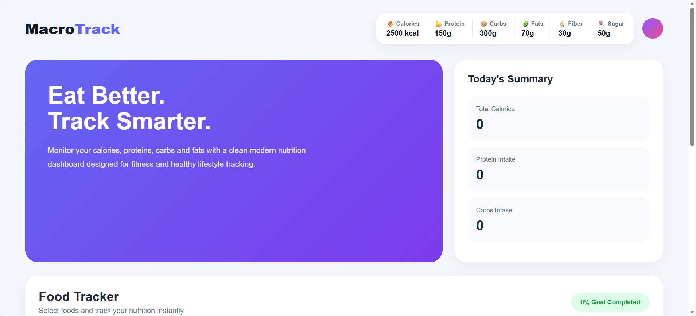
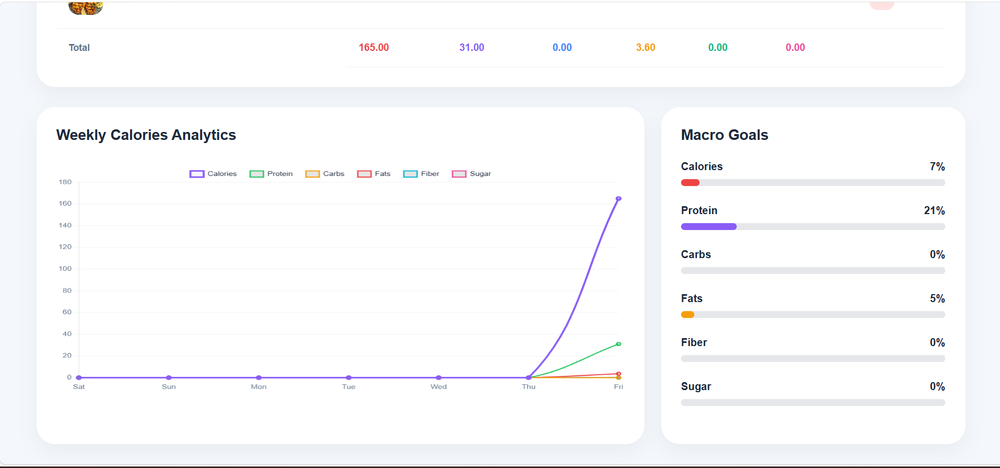
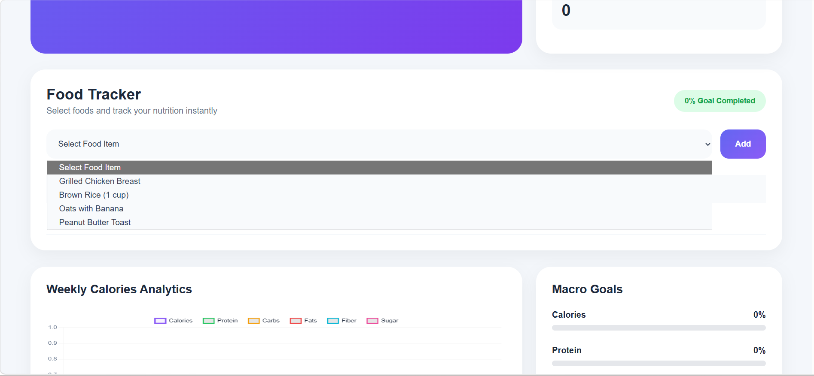

# 🥗 MacroTrack

> A full-stack macronutrient tracking web application built using Django, PostgreSQL, JavaScript, jQuery, AJAX, and Chart.js.

MacroTrack helps users log meals, track calories, monitor macronutrients, and visualize nutrition analytics through interactive dashboards and real-time charts.

---

# 📌 Overview

MacroTrack is a nutrition tracking platform designed to help users maintain healthy eating habits by monitoring their daily calorie intake and macronutrients, including:

* Calories
* Protein
* Carbohydrates
* Fats
* Fiber
* Sugar

The application provides a clean and responsive dashboard with interactive charts, progress tracking, and real-time meal management.

---

# 🚀 Features

## 🍱 Meal Management

* Add consumed meals dynamically
* Delete meals instantly using AJAX
* Real-time updates without page reload

## 📊 Nutrition Analytics

* Weekly analytics dashboard using Chart.js
* Track calories and macronutrients visually
* Interactive line charts for nutrition trends

## 🎯 Daily Goal Tracking

* Daily calorie goal monitoring
* Protein tracking
* Carbs tracking
* Fat tracking
* Fiber tracking
* Sugar tracking
* Dynamic macro progress bars

## ⚡ Real-Time Updates

* AJAX-based CRUD operations
* Live dashboard updates
* Dynamic chart updates
* Instant progress recalculation

## 📱 Responsive UI

* Mobile responsive design
* Clean dashboard layout
* Modern card-based UI
* Smooth user experience

---

# 🛠️ Tech Stack

## Backend


## Database


## Frontend


## Charts & Visualization


---

# 📸 Screenshots

## 🏠 Dashboard



---

## 📈 Weekly Analytics



---

## 🍽️ Meal Tracking



---

# ⚙️ Installation Guide

## 1️⃣ Clone the Repository

```bash
git clone https://github.com/Hitendra15/macro-tracker.git
```

---

## 2️⃣ Navigate to Project Directory

```bash
cd macro-tracker
```

---

## 3️⃣ Create Virtual Environment

### Windows

```bash
python -m venv env
```

### Mac/Linux

```bash
python3 -m venv env
```

---

## 4️⃣ Activate Virtual Environment

### Windows

```bash
env\Scripts\activate
```

### Mac/Linux

```bash
source env/bin/activate
```

---

## 5️⃣ Install Dependencies

```bash
pip install -r requirements.txt
```

---

## 6️⃣ Configure PostgreSQL Database

Update your database credentials inside:

```python
settings.py
```

Example:

```python
DATABASES = {
    'default': {
        'ENGINE': 'django.db.backends.postgresql',
        'NAME': 'macrotrack',
        'USER': 'postgres',
        'PASSWORD': 'your_password',
        'HOST': 'localhost',
        'PORT': '5432',
    }
}
```

---

## 7️⃣ Apply Migrations

```bash
python manage.py makemigrations
python manage.py migrate
```

---

## 8️⃣ Create Superuser

```bash
python manage.py createsuperuser
```

---

## 9️⃣ Run Development Server

```bash
python manage.py runserver
```

---

# 🌐 Application URL

After running the server:

```bash
http://127.0.0.1:8000/
```

---

# 📂 Project Structure

```bash
macro-tracker/
│
├── food/
│   ├── migrations/
│   ├── templates/
│   ├── static/
│   ├── models.py
│   ├── views.py
│   ├── urls.py
│   └── admin.py
│
├── templates/
├── static/
├── media/
├── screenshots/
├── .gitignore
├── .env.example
├── manage.py
├── requirements.txt
└── README.md
```

---

# 📊 Core Functionalities

| Feature              | Description                    |
| -------------------- | ------------------------------ |
| Meal Logging         | Add daily food consumption     |
| Nutrition Tracking   | Track calories & macros        |
| Dashboard Analytics  | Weekly nutrition visualization |
| AJAX Updates         | Dynamic updates without reload |
| Macro Goals          | Track nutrition goals          |
| Delete Functionality | Remove meals dynamically       |
| Responsive Design    | Mobile-friendly dashboard      |

---

# 🔥 Macro Goals Included

| Nutrient | Goal      |
| -------- | --------- |
| Calories | 2500 kcal |
| Protein  | 150 g     |
| Carbs    | 300 g     |
| Fats     | 70 g      |
| Fiber    | 30 g      |
| Sugar    | 50 g      |

---

# 📈 Analytics Included

* Calories Tracking
* Protein Tracking
* Carbohydrate Tracking
* Fat Tracking
* Fiber Tracking
* Sugar Tracking
* Weekly Nutrition Trends
* Daily Goal Completion

---

# 🎨 UI Features

* Modern dashboard layout
* Interactive charts
* Dynamic progress bars
* Gradient cards
* Responsive tables
* SweetAlert confirmations
* Real-time UI updates

---

# 🔮 Future Improvements

* User authentication
* Custom nutrition goals
* Food search functionality
* Barcode scanner
* Export reports (PDF/Excel)
* Dark mode
* REST API integration
* Mobile application
* AI nutrition recommendations
* Water intake tracking

---

# 👨‍💻 Author

## Hitendra

### GitHub

https://github.com/Hitendra15

### Project Repository

https://github.com/Hitendra15/macro-tracker

---

# ⭐ Support

If you found this project helpful, please give it a ⭐ on GitHub.

---

# 📄 License

This project is licensed under the MIT License.
